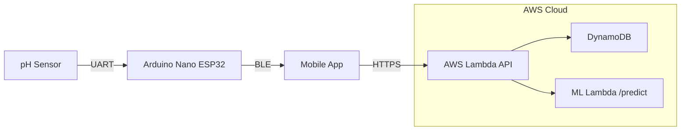

# CLINISENSE: BMES Mobile Healthcare Application

### BMES MEDTRONIC PROJECT COMPETITION 2026
A full-stack remote patient monitoring system built for **CSULB Biomedical Engineering Society (BMES)**. An Arduino Nano ESP32 reads pH sensor data, streams it over BLE to a React Native mobile app, stores it in AWS, and automatically alerts doctors when readings fall outside safe ranges.

---

## Table of Contents

- [Project Overview](#project-overview)
- [System Architecture](#system-architecture)
- [Technology Stack](#technology-stack)
- [Project Structure](#project-structure)
- [Getting Started](#getting-started)
  - [Prerequisites](#prerequisites)
  - [Frontend](#frontend-react-native--expo)
  - [Backend](#backend-aws-serverless)
  - [ML Lambda](#ml-lambda)
  - [Firmware](#firmware-esp32)
  - [BLE → AWS Test Script](#ble--aws-test-script)
- [User Roles](#user-roles)
- [Navigation Flow](#navigation-flow)
- [pH Alert Thresholds](#ph-alert-thresholds)
- [Machine Learning](#machine-learning)
- [BLE Communication Protocol](#ble-communication-protocol)
- [API Reference](#api-reference)
- [Authentication & Authorization](#authentication--authorization)
- [Data Models & Schema](#data-models--schema)
- [End-to-End Data Flow](#end-to-end-data-flow)

---

## Project Overview

This system enables continuous, real-time pH monitoring of patient wounds and body fluids. The hardware sensor (Arduino Nano ESP32) reads pH/voltage values and transmits them via Bluetooth Low Energy (BLE) to a cross-platform mobile app. The app forwards readings to a serverless AWS backend, which stores them, evaluates alert thresholds, and notifies assigned doctors via push notification.

**Roles:**

| Role | Responsibilities |
|------|-----------------|
| Admin | Create patients, assign doctors, manage the system |
| Doctor | View assigned patients, receive alerts, monitor pH trends |
| Sensor (ESP32) | Read physical pH/voltage values and transmit via BLE |

---

## System Architecture



---

## Technology Stack

### Frontend

| Technology | Version | Purpose |
|-----------|---------|---------|
| React Native | 0.81.5 | Cross-platform mobile UI |
| Expo | 54.0.33 | Development platform & tooling |
| TypeScript | 5.9.2 | Type-safe JavaScript |
| Expo Router | 6.0.23 | File-based navigation |
| AWS Amplify | 6.16.2 | AWS service integration |
| react-native-ble-plx | 3.5.1 | Bluetooth Low Energy |
| expo-notifications | 0.32.16 | Push notifications |
| @react-navigation/bottom-tabs | 7.4.0 | Tab bar navigation |

### Backend

| Technology | Purpose |
|-----------|---------|
| Node.js 18.x (AWS Lambda) | Serverless compute |
| Serverless Framework 3 | Infrastructure-as-code deployment |
| AWS DynamoDB | NoSQL database |
| AWS Cognito | User authentication |
| AWS API Gateway | HTTP API routing |
| AWS ECR | Docker image registry (ML) |

### Firmware & ML

| Layer | Tech |
|-------|------|
| Firmware | C++ · Arduino/FreeRTOS · NimBLE · PlatformIO |
| ML | Python · scikit-learn · Docker · AWS Lambda (container) |

---

## Project Structure

```
mobile-healthcare-application/
├── frontend/                        # React Native Expo app
│   ├── app/                         # File-based routes (Expo Router)
│   │   ├── _layout.tsx              # Root stack layout
│   │   ├── index.tsx                # Splash boot screen
│   │   ├── onboarding.tsx           # Login/Sign Up entry
│   │   ├── signin.tsx               # Authentication screen
│   │   ├── signup.tsx               # Registration screen
│   │   ├── confirm.tsx              # Email code confirmation
│   │   ├── doctor/                  # Doctor role screens
│   │   │   ├── _layout.tsx          # Tab navigation (Patients, Alerts, Profile)
│   │   │   ├── patients.tsx         # Patient list
│   │   │   ├── patient.tsx          # Patient detail + pH chart
│   │   │   ├── alerts.tsx           # Alert dashboard
│   │   │   └── profile.tsx          # Doctor profile
│   │   └── admin/                   # Admin role screens
│   │       ├── _layout.tsx          # Tab navigation (Patients, Profile)
│   │       ├── patients.tsx         # Create/manage patients
│   │       └── profile.tsx          # Admin profile
│   └── src/
│       ├── api.ts                   # All API calls (fetch + Amplify auth)
│       ├── amplifyConfig.ts         # AWS Amplify initialization
│       └── aws-exports.js           # Auto-generated AWS config
│
├── backend/                         # Serverless backend
│   ├── serverless.yml               # AWS Lambda + API Gateway config
│   ├── src/
│   │   ├── app.js                   # Express entry point
│   │   ├── controllers/             # Route handlers
│   │   ├── services/                # Business logic
│   │   ├── repositories/            # DynamoDB data access
│   │   ├── validators/              # Input validation
│   │   ├── middleware/              # Express middleware
│   │   ├── utils/                   # Helper functions
│   │   └── config/                  # Constants and configuration
│   └── ml/
│       ├── app.py                   # ML Lambda handler
│       ├── model.joblib             # Trained scikit-learn model
│       ├── label_encoder.joblib     # Label encoder
│       ├── requirements.txt         # Python dependencies
│       └── Dockerfile               # Docker build for ECR
│
├── firmware/
│   └── esp32_nano_uart_ble/
│       ├── platformio.ini           # PlatformIO configuration
│       └── src/
│           ├── main.cpp             # Entry point, FreeRTOS tasks
│           ├── ble.cpp / ble.h      # BLE server & GATT service
│           ├── uart.cpp / uart.h    # Serial UART reading
│           └── data_processing.cpp  # Voltage → pH conversion & JSON serialization
│
├── docs/                            # Documentation assets
└── amplify/                         # AWS Amplify backend config
```

---

## Getting Started

### Prerequisites

- Node.js 18+
- Expo CLI — `npm install -g expo`
- PlatformIO IDE or CLI
- AWS account with Amplify, Lambda, DynamoDB, and Cognito configured
- Serverless Framework — `npm install -g serverless`
- Docker (for ML Lambda deployment)

---

### Frontend (React Native / Expo)

```bash
cd frontend
npm install
npx expo start
```

Scan the QR code with **Expo Go** (Android/iOS) to run on your device.

> **Note:** BLE functionality requires a development build (`expo run:android` / `expo run:ios`). BLE is stubbed in Expo Go mode.

**App config** (`app.json`):
- Package name: `com.mylu004.frontend`
- Orientation: Portrait only
- New Architecture: enabled
- React Compiler: enabled

---

### Backend (AWS Serverless)

```bash
cd backend
npm install
npx serverless deploy   # Deploys to AWS us-east-2
```

Deploys the Express API to AWS Lambda under the `MedtronicHealthAPI` endpoint.

**Base URL:** `https://ttwf6zzrv7.execute-api.us-east-2.amazonaws.com/dev`

All requests require: `Authorization: Bearer <idToken>` and `Content-Type: application/json`.

- contact (My Lu) [https://github.com/MyLu004] : myluwork004@gmail.com, for more information about the set up and the access
---

### ML Lambda

The ML model runs as a Docker container (based on `public.ecr.aws/lambda/python:3.11`) on AWS ECR, deployed as a Lambda function via the Serverless Framework at `POST /predict` with 1024 MB memory and a 30-second timeout.

```bash
cd backend/ml
docker build -t bmes-ml .
# Push to ECR and update the image URI in serverless.yml before deploying
npx serverless deploy
```

**Dependencies** (`requirements.txt`):
```
scikit-learn==1.6.1
numpy==1.26.4
scipy==1.13.1
pandas==2.2.3
joblib
```

---

### Firmware (ESP32)

1. Open `firmware/esp32_nano_uart_ble/` in PlatformIO.
2. Connect the Arduino Nano ESP32 via USB.
3. Build and upload:

```bash
pio run --target upload
pio device monitor   # 115200 baud
```

The firmware runs three FreeRTOS tasks:

| Task | Description |
|------|-------------|
| UART Task | Reads raw sensor data from serial |
| Data Processing Task | Converts voltage to pH |
| BLE Task | Broadcasts pH + voltage as JSON over BLE |

BLE Service UUID: `cdbe9e3f-2839-4d61-a1d9-4043e0e0eaeb`

---

### BLE → AWS Test Script

Use this to test the full data pipeline without the mobile app:

```bash
pip install bleak httpx
cd firmware

python test_ble_to_aws.py                          # Auto-scan for ESP32, upload readings to AWS
python test_ble_to_aws.py --no-upload              # BLE only, skip upload
python test_ble_to_aws.py --mock                   # Mock mode — send test readings without BLE
python test_ble_to_aws.py --address AA:BB:CC:DD:EE:FF   # Connect by address directly
```

---

## User Roles

### Doctor Screens

- **`doctor/patients.tsx`** — Fetches assigned patients via `GET /patients?doctorId={id}`. Paginated list with pull-to-refresh.
- **`doctor/patient.tsx`** — Shows last 20 pH readings in a color-coded bar chart, patient info, and BLE connection UI.
- **`doctor/alerts.tsx`** — Alert dashboard with severity badges, time-ago timestamps, and acknowledge button. Filterable by severity.
- **`doctor/profile.tsx`** — Doctor info and logout.

### Admin Screens

- **`admin/patients.tsx`** — System-wide patient list. Create patients (name, age, assigned doctor) and reassign doctors via `PUT /patients/{patientId}`.
- **`admin/profile.tsx`** — Admin info and logout.

### Push Notifications

Handled in `doctor/_layout.tsx`:
1. Requests Expo push permission on mount
2. Stores push token server-side via `PUT /users/push-token`
3. Backend triggers Expo Push API when a critical or warning reading is submitted

---

## Navigation Flow

```
App Launch
└── index.tsx (2-second splash)
    └── onboarding.tsx
        ├── [Sign In] ──► signin.tsx
        │   ├── role=doctor ──► /doctor/patients (tabs)
        │   └── role=admin  ──► /admin/patients  (tabs)
        └── [Sign Up] ──► signup.tsx
                          └── confirm.tsx ──► signin.tsx

Doctor Tab Navigator:
├── Patients Tab ──► doctor/patients.tsx
│   └── tap patient ──► doctor/patient.tsx
├── Alerts Tab   ──► doctor/alerts.tsx
└── Profile Tab  ──► doctor/profile.tsx

Admin Tab Navigator:
├── Patients Tab ──► admin/patients.tsx
└── Profile Tab  ──► admin/profile.tsx
```

---

## pH Alert Thresholds

| pH Range | Status | Chart Color |
|----------|--------|-------------|
| 6.8 – 7.6 | Normal | 🟢 Green |
| 6.5 – 6.8 or 7.6 – 8.0 | Warning | 🟠 Orange |
| < 6.5 or > 8.0 | Critical | 🔴 Red |

Doctors receive push notifications when a reading enters **Warning** or **Critical** range.

---

## Machine Learning

Location: `backend/ml/`

The ML component classifies a patient's pH readings into a severity category, used to trigger clinical alerts in the doctor portal.

### Deployment

Runs as a Docker container (based on `public.ecr.aws/lambda/python:3.11`) pushed to AWS ECR and deployed as an AWS Lambda function via the Serverless Framework at `POST /predict` — 1024 MB memory, 30-second timeout.

### Input

The endpoint expects a JSON body with the last 10 readings (oldest → newest):

```json
{
  "readings": [
    { "ph_estimated": 7.1, "voltage_raw": 2.31, "temperature_c": 36.6 },
    ...
  ]
}
```

### Feature Engineering

Before prediction, rolling statistics are computed over the 10-reading window. Only the latest row's features are passed to the model — the window is used purely to capture trend context.

| Feature | Description |
|---------|-------------|
| `ph_estimated` | Raw pH value |
| `voltage_raw` | Raw voltage |
| `temperature_c` | Temperature |
| `ph_rolling_mean` | Rolling mean of pH (window = 10) |
| `ph_rolling_std` | Rolling std of pH (window = 10) |
| `ph_rolling_min` | Rolling min of pH (window = 10) |
| `volt_rolling_std` | Rolling std of voltage (window = 10) |

### Model

- `model.joblib` — serialized scikit-learn classifier
- `label_encoder.joblib` — label encoder
- Three output classes: `Normal`, `Suspected`, `Confirmed`

### Output

```json
{
  "severity": "warning",
  "prediction_label": "Suspected",
  "confidence": 0.8712,
  "description": "Classified as Suspected (87.1% confidence)"
}
```

**Severity mapping:**

| Model Label | App Severity |
|-------------|-------------|
| `Normal` | `normal` |
| `Suspected` | `warning` |
| `Confirmed` | `critical` |

---

## BLE Communication Protocol

> TODO

---

## API Reference

**Base URL:** `https://ttwf6zzrv7.execute-api.us-east-2.amazonaws.com/dev`  
All endpoints require `Authorization: Bearer <idToken>`.

### Users

| Method | Path | Description |
|--------|------|-------------|
| POST | `/users` | Create or update user profile |
| GET | `/users?email={email}` | Get user profile |
| PUT | `/users/push-token` | Update Expo push notification token |

### Patients

| Method | Path | Description |
|--------|------|-------------|
| POST | `/patients` | Create new patient (admin) |
| GET | `/patients` | Get all patients (admin) |
| GET | `/patients?doctorId={id}` | Get doctor's assigned patients |
| GET | `/patients/{patientId}` | Get single patient detail |
| PUT | `/patients/{patientId}` | Reassign patient to doctor |

### Readings

| Method | Path | Description |
|--------|------|-------------|
| GET | `/patients/{id}/readings` | Get pH readings for a patient |
| POST | `/readings` | Submit a new pH reading |

### Alerts

| Method | Path | Description |
|--------|------|-------------|
| GET | `/alerts?doctorEmail={email}` | Get alerts for a doctor |
| POST | `/alerts/acknowledge` | Acknowledge an alert |

### ML Prediction

| Method | Path | Description |
|--------|------|-------------|
| POST | `/predict` | Run ML severity classification |

**Request body** — last 10 readings, oldest → newest:
```json
{
  "readings": [
    { "ph_estimated": 7.1, "voltage_raw": 2.31, "temperature_c": 36.6 },
    ...
  ]
}
```

**Response:**
```json
{
  "severity": "warning",
  "prediction_label": "Suspected",
  "confidence": 0.8712,
  "description": "Classified as Suspected (87.1% confidence)"
}
```

**Severity mapping:**

| Model Label | App Severity |
|-------------|-------------|
| Normal | `normal` |
| Suspected | `warning` |
| Confirmed | `critical` |

---

## Authentication & Authorization

### Cognito Configuration

| Parameter | Value |
|-----------|-------|
| User Pool ID | `us-east-2_XKq4cKesI` |
| App Client ID | `md4a9m3t963hasakbkmqss41i` |
| Identity Pool | `us-east-2:191ac2fb-5e7a-444e-aad2-4d772980 8532` |
| Region | `us-east-2` |

### Role Management

Roles are stored as Cognito Groups (`admin` and `doctor`). During sign-in, the app reads `idToken.payload["cognito:groups"]` and routes to the appropriate tab navigator.

### Auth Flow

```
signUp()        → Cognito sends confirmation email
confirmSignUp() → Activates the account
signIn()        → Returns idToken with group membership
App routes      → /doctor/* or /admin/*
```

---

## Data Models & Schema

### User
```json
{
  "email": "string",        // Primary key (Cognito username)
  "fullName": "string",
  "role": "admin | doctor",
  "userId": "string",       // UUID
  "pushToken": "string"     // Optional: Expo push notification token
}
```

### Patient
```json
{
  "patientId": "string",          // UUID (PK)
  "fullName": "string",
  "age": "number",
  "assignedDoctorId": "string",   // Doctor's userId
  "createdByAdminId": "string",
  "status": "string",
  "createdAt": "string",          // ISO 8601 timestamp
  "linkedAt": "string"
}
```

### Reading
```json
{
  "patientId": "string",      // PK
  "readingSK": "string",      // SK: timestamp-based sort key
  "pH": "number",
  "voltage_raw": "number",    // Optional
  "temperature_c": "number",  // Optional
  "timestamp": "string"       // ISO 8601
}
```

### Alert
```json
{
  "patientId": "string",
  "readingSK": "string",
  "patientName": "string",
  "pH": "number",
  "severity": "critical | warning",
  "title": "string",
  "description": "string",
  "timestamp": "string",
  "acknowledged": "boolean",
  "doctorEmail": "string"     // Determines who receives the alert
}
```

### DynamoDB Tables

| Table | Purpose | Primary Key |
|-------|---------|-------------|
| `Users-dev` | User profiles (admin/doctor) | `email` (PK) |
| `Patients-dev` | Patient records | `patientId` (PK) |
| `Readings-dev` | pH readings per patient | `patientId` (PK) + `readingSK` (SK) |
| `Alerts-dev` | Auto-generated alerts | `patientId` (PK) + `readingSK` (SK) |

---

## End-to-End Data Flow

### Normal Reading Submission

```
1.  Sensor ADC reads voltage from pH electrode
2.  ESP32 converts voltage → pH value
3.  ESP32 sends JSON via UART → processingTask → bleTask
4.  BLE notification sent to mobile app
5.  Mobile app parses JSON, displays reading
6.  Mobile app calls POST /readings with pH, voltage, temperature
7.  Lambda saves reading to DynamoDB Readings-dev table
8.  Lambda evaluates thresholds:
      pH < 6.5 or > 8.0  →  Critical alert
      pH < 6.8 or > 7.6  →  Warning alert
9.  If alert triggered:
    a. Alert record saved to DynamoDB Alerts-dev
    b. Expo Push API called with doctor's push token
    c. Doctor receives push notification on mobile
10. Doctor opens app → Alerts tab shows the new alert
11. Doctor taps "Acknowledge" → POST /alerts/acknowledge
```

### ML Prediction Flow

```
1. Mobile app or backend collects last 10 readings for a patient (oldest → newest)
2. POST /predict called with readings array
3. ML Lambda performs feature engineering:
   - Computes rolling statistics over the 10-reading window
   - Passes only the latest row's features to the model
4. scikit-learn classifier runs and returns a label + confidence score
5. Result displayed in patient detail screen or used to generate alerts
```

**Feature Engineering** — computed over the 10-reading window:

| Feature | Description |
|---------|-------------|
| `ph_estimated` | Raw pH value |
| `voltage_raw` | Raw voltage |
| `temperature_c` | Temperature |
| `ph_rolling_mean` | Rolling mean of pH (window = 10) |
| `ph_rolling_std` | Rolling std of pH (window = 10) |
| `ph_rolling_min` | Rolling min of pH (window = 10) |
| `volt_rolling_std` | Rolling std of voltage (window = 10) |

**Model artifacts:**
- `model.joblib` — serialized scikit-learn classifier
- `label_encoder.joblib` — label encoder for the three output classes: `Normal`, `Suspected`, `Confirmed`

---


## 👥 Contributors

* **Team Lead / Firmware Lead**: [Jonathan Fuentes](https://github.com/jonathan-fuentes01)
* **Backend Lead**: [My Lu](https://github.com/MyLu004)
* **Frontend Lead**: [Vivian Vu](https://github.com/viveevu11)
* **ML/AI Lead**: [Anna Gelisanga](https://github.com/orgs/csulbwic/people/shiyuriaki)

